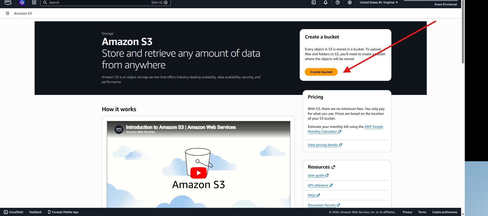
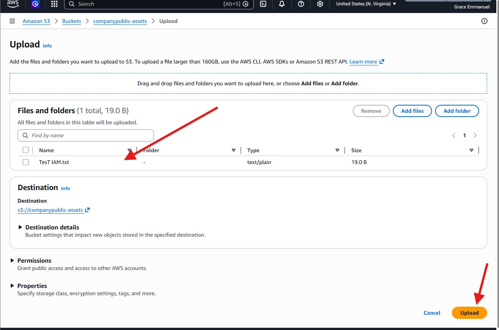
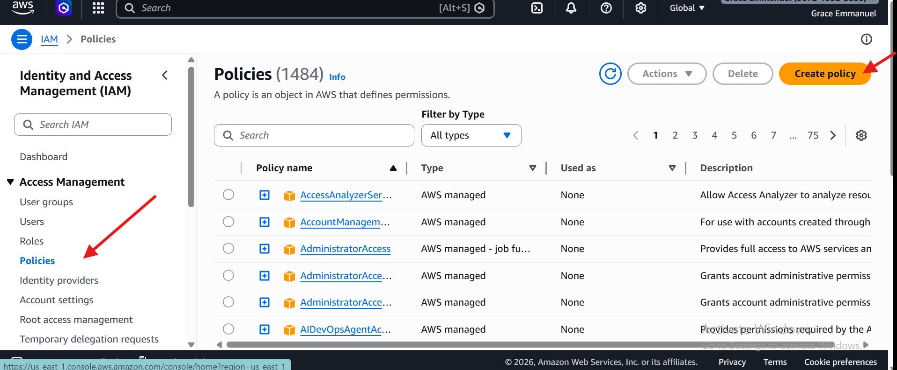
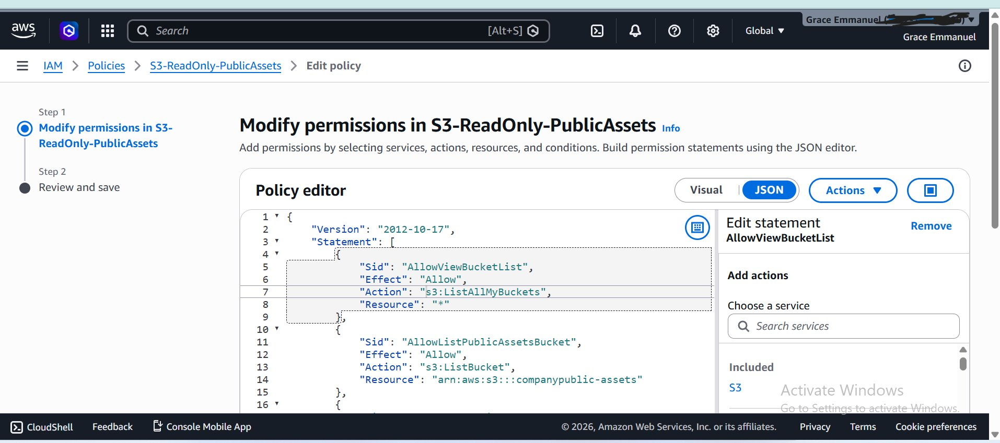
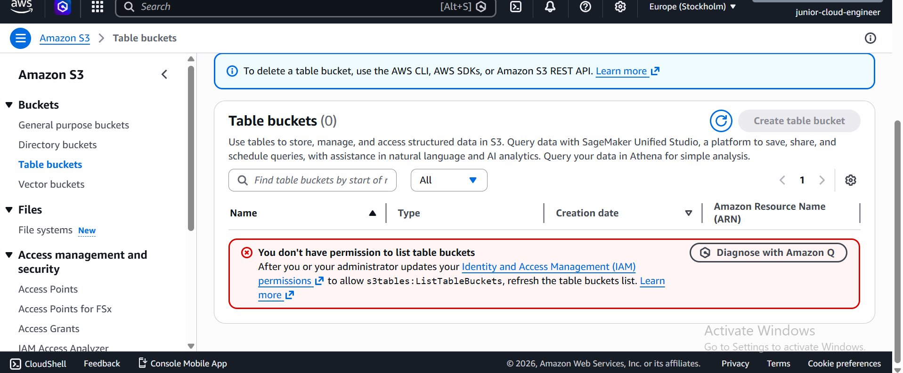
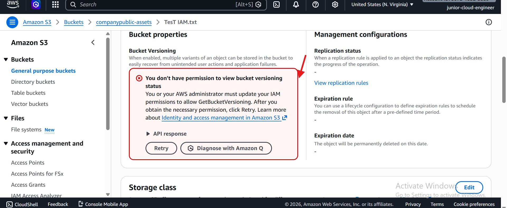

# 🔐 AWS IAM Least Privilege Lab — S3 Access Control Challenge

> **A hands-on security lab demonstrating how to write secure, scoped IAM policies that enforce the Principle of Least Privilege — using Amazon S3 as the real-world target resource.**

---

## 📋 Table of Contents

- [The Security Challenge](#the-security-challenge)
- [What is the Principle of Least Privilege?](#what-is-the-principle-of-least-privilege)
- [Part 1 — The Challenge: Fix the Broken Policy](#part-1--the-challenge-fix-the-broken-policy)
- [Part 2 — Writing the Secure Policy](#part-2--writing-the-secure-policy)
- [Part 3 — Lab Implementation](#part-3--lab-implementation)
  - [Step 1 — Navigate to Amazon S3](#step-1--navigate-to-amazon-s3)
  - [Step 2 — Create the S3 Bucket](#step-2--create-the-s3-bucket)
  - [Step 3 — Upload a Test File](#step-3--upload-a-test-file)
  - [Step 4 — Create the IAM User](#step-4--create-the-iam-user)
  - [Step 5 — Create the Custom IAM Policy](#step-5--create-the-custom-iam-policy)
  - [Step 6 — Attach the Policy to the User](#step-6--attach-the-policy-to-the-user)
  - [Step 7 — Sign In as the Junior Engineer](#step-7--sign-in-as-the-junior-engineer)
  - [Step 8 — Verify Access is Correctly Scoped](#step-8--verify-access-is-correctly-scoped)
- [Results & Proof of Least Privilege](#results--proof-of-least-privilege)
- [Security Takeaways](#security-takeaways)

---

## The Security Challenge

> **Scenario:** A new **Junior Cloud Engineer** has joined the team. They only need to **view files** in an S3 bucket called `companypublic-assets`. They should **NOT** be able to delete files or access the `company-payroll` bucket.

**The Broken Policy (What NOT to do):**

```json
{
  "Effect": "Allow",
  "Action": "s3:*",
  "Resource": "*"
}
```

This single policy statement is a critical security misconfiguration. Let's break down exactly why — and then fix it.

---

## What is the Principle of Least Privilege?

The **Principle of Least Privilege (PoLP)** is one of the most fundamental concepts in cybersecurity and cloud security. It states:

> *"Every user, process, or system should have access to only the minimum resources and permissions required to perform its specific function — nothing more."*

In practice, this means:
- A read-only user should **never** have delete permissions
- A user who needs access to one bucket should **never** be able to see all buckets
- Permissions should be scoped to the **exact resource** needed, not `*` (everything)

### Why Does It Matter?

| Without PoLP | With PoLP |
|---|---|
| A compromised account can delete all S3 data | A compromised account can only read one bucket |
| Insider threats can access sensitive payroll data | Insider threats are blocked from out-of-scope resources |
| Accidental misconfiguration can destroy infrastructure | Scope limits the blast radius of mistakes |
| Audit trails are noisy and hard to review | Actions are predictable and easy to audit |

---

## Part 1 — The Challenge: Fix the Broken Policy

### ❌ The Insecure Policy

```json
{
  "Effect": "Allow",
  "Action": "s3:*",
  "Resource": "*"
}
```

### 🔍 Identifying the Two Problems

**Problem 1 — Wildcard Action (`s3:*`)**

`s3:*` grants **every single S3 action** to the user. This includes:

| Action | Risk |
|---|---|
| `s3:DeleteObject` | Can permanently delete any file in any bucket |
| `s3:DeleteBucket` | Can delete entire buckets including all data |
| `s3:PutObject` | Can upload malicious files or overwrite existing ones |
| `s3:GetBucketAcl` | Can read bucket permission configurations |
| `s3:PutBucketPolicy` | Can modify who has access to the bucket |
| `s3:PutBucketAcl` | Can change ownership and access settings |

A Junior Cloud Engineer who only needs to **view public assets** has no business having any of these permissions.

**Problem 2 — Wildcard Resource (`"Resource": "*"`)**

`"Resource": "*"` means this policy applies to **every S3 bucket and every object** in the entire AWS account. This means the user can perform the above actions on:
- `companypublic-assets` ← the bucket they should access
- `company-payroll` ← the bucket they should **never** see
- Every other bucket that exists now or is created in the future

This violates data segregation and confidentiality principles — particularly critical when sensitive resources like payroll data are in the same account.

---

### ✅ The Fixed Policy (Principle of Least Privilege Applied)

The corrected policy grants only what is needed — nothing more:

```json
{
  "Version": "2012-10-17",
  "Statement": [
    {
      "Sid": "AllowViewBucketList",
      "Effect": "Allow",
      "Action": "s3:ListAllMyBuckets",
      "Resource": "*"
    },
    {
      "Sid": "AllowListPublicAssetsBucket",
      "Effect": "Allow",
      "Action": "s3:ListBucket",
      "Resource": "arn:aws:s3:::companypublic-assets"
    },
    {
      "Sid": "AllowReadPublicAssetsObjects",
      "Effect": "Allow",
      "Action": "s3:GetObject",
      "Resource": "arn:aws:s3:::companypublic-assets/*"
    }
  ]
}
```

### Why Each Statement is Here

| Statement ID | Action | Resource | Reason |
|---|---|---|---|
| `AllowViewBucketList` | `s3:ListAllMyBuckets` | `*` | Required to display the bucket list in the S3 console. Without this, the user sees a blank screen — `*` is necessary here as this action has no resource-level control |
| `AllowListPublicAssetsBucket` | `s3:ListBucket` | `arn:aws:s3:::companypublic-assets` | Allows listing the objects **inside** the correct bucket only. Scoped to exact bucket ARN. |
| `AllowReadPublicAssetsObjects` | `s3:GetObject` | `arn:aws:s3:::companypublic-assets/*` | Allows downloading/viewing **files** inside the bucket. The `/*` means all objects within, but only this bucket. |

### What This Policy CANNOT Do

- ❌ Cannot list or access `company-payroll` bucket contents
- ❌ Cannot delete any object (`s3:DeleteObject` not granted)
- ❌ Cannot upload files (`s3:PutObject` not granted)
- ❌ Cannot change bucket permissions (`s3:PutBucketPolicy` not granted)
- ❌ Cannot delete the bucket (`s3:DeleteBucket` not granted)
- ❌ Cannot view versioning, replication, or lifecycle settings

---

## Part 2 — Writing the Secure Policy

### The Goal

Write a policy that allows **only** the `s3:GetObject` (read/download) action on a **specific resource**.

### The Minimal Secure Read Policy

```json
{
  "Version": "2012-10-17",
  "Statement": [
    {
      "Sid": "AllowGetObjectPublicAssets",
      "Effect": "Allow",
      "Action": "s3:GetObject",
      "Resource": "arn:aws:s3:::companypublic-assets/*"
    }
  ]
}
```

### Breaking Down Every Field

```
"Version": "2012-10-17"
```
The IAM policy language version. Always use `2012-10-17` — this is the current version that supports policy variables and all modern features.

```
"Statement": [ ... ]
```
An array of permission statements. Each statement is an independent rule. You can have multiple statements in one policy.

```
"Sid": "AllowGetObjectPublicAssets"
```
Statement ID — a human-readable label for this rule. Optional but strongly recommended for readability and debugging.

```
"Effect": "Allow"
```
Either `Allow` or `Deny`. AWS **denies by default** — you must explicitly allow what you want. `Deny` always wins over `Allow` when both apply.

```
"Action": "s3:GetObject"
```
The specific API call being permitted. `s3:GetObject` allows downloading (reading) an object's content. It does NOT allow listing, deleting, or modifying.

```
"Resource": "arn:aws:s3:::companypublic-assets/*"
```
The Amazon Resource Name (ARN) of the target. Breaking this down:
- `arn` — Amazon Resource Name prefix
- `aws` — AWS partition (use `aws-cn` for China, `aws-us-gov` for GovCloud)
- `s3` — The service
- `:::` — Region and account ID are omitted (S3 bucket names are globally unique)
- `companypublic-assets` — The specific bucket name
- `/*` — All objects within the bucket

### The Amazon Resource Name (ARN) Pattern for S3

```
Bucket ARN:  arn:aws:s3:::bucket-name
Object ARN:  arn:aws:s3:::bucket-name/object-key
All objects: arn:aws:s3:::bucket-name/*
```

> 💡 **Key Insight:** When you need both `s3:ListBucket` (list files) AND `s3:GetObject` (read files), you need TWO separate resource lines — `s3:ListBucket` targets the **bucket**, and `s3:GetObject` targets the **objects inside** (`/*`). Using `/*` for `ListBucket` will cause an access denied error.

---

## Part 3 — Lab Implementation

Now we implement this in a live AWS environment to prove it works.

### Architecture Overview

```
┌─────────────────────────────────────────────────────────┐
│                    AWS Account (Root)                    │
│                                                         │
│  ┌──────────────────┐    ┌──────────────────────────┐  │
│  │   S3 Buckets      │    │       IAM Resources       │  │
│  │                   │    │                           │  │
│  │ ✅ companypublic- │    │  User: junior-cloud-      │  │
│  │    assets         │    │        engineer           │  │
│  │                   │    │                           │  │
│  │ 🔒 company-       │    │  Policy: S3-ReadOnly-     │  │
│  │    payroll        │    │          PublicAssets      │  │
│  └──────────────────┘    └──────────────────────────┘  │
│                                                         │
│  junior-cloud-engineer → CAN: List & Read companypublic-assets
│  junior-cloud-engineer → CANNOT: Access company-payroll │
│  junior-cloud-engineer → CANNOT: Delete any files       │
└─────────────────────────────────────────────────────────┘
```

---

### Step 1 — Navigate to Amazon S3

In the AWS Console top search bar, type **`S3`** and select **S3 — Scalable Storage in the Cloud**.


> **What you see:** The AWS search results showing S3 under Services, with S3 Glacier and AWS Snow Family as related storage options. Also shown are S3-related features (S3 Files, S3 on Outposts, Exports to S3) and documentation links. Always select the top result under **Services**.

---

### Step 2 — Create the S3 Bucket

On the Amazon S3 landing page, click **Create bucket** (top-right panel).



> **What you see:** The Amazon S3 service introduction page. The red arrow points to the **Create bucket** button in the top-right panel. The page also shows pricing information (pay only for what you use) and resource links including the User Guide, API Reference, and FAQs.

On the Create bucket form, configure the following:


> **What you see:** The Create bucket configuration page with:
> - **Bucket name:** `companypublic-assets` (red arrow pointing to the name field)
>   - Bucket names must be 3–63 characters, globally unique, and use only lowercase letters, numbers, and hyphens
> - **Object Ownership:** `ACLs disabled (recommended)` — all objects are owned by this account and access is controlled purely through IAM policies (not ACLs)
> - **Block Public Access settings:** `Block all public access` ✅ checked — this is the secure default. Even though this bucket is named "public-assets", actual public access should be managed through IAM, not by opening the bucket to the internet.
>
> Scroll down and click **Create bucket**.

**Configuration summary:**

| Setting | Value | Reason |
|---|---|---|
| Bucket name | `companypublic-assets` | Descriptive, matches ARN in our policy |
| ACLs | Disabled | Use IAM policies for access control (best practice) |
| Block all public access | Enabled | Prevents accidental internet exposure |
| Region | US East (N. Virginia) | us-east-1 — default region |

After clicking Create bucket, a green confirmation banner confirms success:


> **What you see:** The `companypublic-assets` bucket dashboard showing:
> - ✅ Green banner — *"Successfully created bucket 'companypublic-assets'"*
> - The bucket is currently empty — `Objects (0)` and `No objects`
> - Tab navigation: Objects, Metadata, Properties, Permissions, Metrics, Management, File systems, Access Points
> - Action buttons: Copy S3 URI, Copy URL, Download, Open, Delete, Actions, Create folder, **Upload**

---

### Step 3 — Upload a Test File

Click the orange **Upload** button to add a test file to the bucket.



> **What you see:** The Upload page for `companypublic-assets`. Key areas:
> - **Drag-and-drop zone** at the top — drag files directly here
> - **Files and folders** section — shows `TesT IAM.txt` (1 total, 19.0 B) has been added
> - The red arrow (top) points to the file listing — the file is queued for upload
> - **Destination:** `s3://companypublic-assets` — confirms the correct bucket
> - **Permissions** and **Properties** sections — expandable for advanced configuration
> - The red arrow (bottom-right) points to the **Upload** button — click this to start the upload

Click **Upload**.


> **What you see:** The Upload status page confirming success:
> - ✅ Green banner — *"Upload succeeded"*
> - **Summary:** Destination `s3://companypublic-assets`, **Succeeded: 1 file, 19.0 B (100.00%)**, Failed: 0 files
> - **Files and folders table:** `TesT IAM.txt` — text/plain, 19.0 B — Status: ✅ **Succeeded**
>
> The test file is now in the bucket. This is the file the junior engineer should be able to **read** but not **delete**.

---

### Step 4 — Create the IAM User

Navigate to **IAM → Users → Create user** to create the Junior Cloud Engineer account.


> **What you see:** Step 1 of the Create User wizard — Specify user details. The red arrows highlight:
> - **User name:** `junior-cloud-engineer` — a descriptive, role-based username
> - **Console password:** `Autogenerated password` selected — AWS generates a secure random password (viewable after creation)
> - **Users must create a new password at next sign-in:** ⬜ *Unchecked* — in this lab we're managing the password directly; in production this should be enabled
> - **Next** button (bottom-right) — click to proceed to permissions
>
> Click **Next**.

> 💡 **Naming Convention Tip:** Use descriptive, role-based usernames like `junior-cloud-engineer`, `soc-analyst`, or `devops-lead` rather than personal names. This makes permissions auditing and off-boarding cleaner.

---

### Step 5 — Create the Custom IAM Policy

Before attaching permissions to the user, we need to create the custom policy. Navigate to **IAM → Policies**.



> **What you see:** The IAM Policies list showing **1,484 policies** — a mix of AWS managed policies (orange box icons) and customer-managed policies. The red arrows highlight:
> - **Policies** in the left sidebar (under Access Management)
> - The orange **Create policy** button (top-right) — this is where we define our custom least-privilege policy
>
> Click **Create policy**.

In the Policy editor, select the **JSON** tab and enter the following policy:

```json
{
  "Version": "2012-10-17",
  "Statement": [
    {
      "Sid": "AllowViewBucketList",
      "Effect": "Allow",
      "Action": "s3:ListAllMyBuckets",
      "Resource": "*"
    },
    {
      "Sid": "AllowListPublicAssetsBucket",
      "Effect": "Allow",
      "Action": "s3:ListBucket",
      "Resource": "arn:aws:s3:::companypublic-assets"
    },
    {
      "Sid": "AllowReadPublicAssetsObjects",
      "Effect": "Allow",
      "Action": "s3:GetObject",
      "Resource": "arn:aws:s3:::companypublic-assets/*"
    }
  ]
}
```



> **What you see:** The **Modify permissions in S3-ReadOnly-PublicAssets** page with the JSON policy editor open. The policy contains three statements (visible on lines 4–16):
> - **Statement 1** (`AllowViewBucketList`) — `s3:ListAllMyBuckets` on `*` — allows the bucket list to render in the S3 console
> - **Statement 2** (`AllowListPublicAssetsBucket`) — `s3:ListBucket` on `arn:aws:s3:::companypublic-assets` — allows listing objects inside the correct bucket
> - The right panel shows **Edit statement** for `AllowViewBucketList` with the S3 service selected under **Included**
>
> The **Visual** and **JSON** toggle buttons (top-right of the editor) let you switch between a visual policy builder and raw JSON. JSON mode gives the most control.

Name the policy **`S3-ReadOnly-PublicAssets`** and click **Create policy**.

A green confirmation banner confirms the policy was created:


> **What you see:** After policy creation, AWS redirects to the Users page showing a ✅ green banner:
> *"Policy S3-ReadOnly-PublicAssets created."* with a **View policy** button.
>
> The Users list now shows **3 users:**
> | Username | Groups | Last Activity | Password Age |
> |---|---|---|---|
> | `Analyst1` | 1 | - | ✅ 19 hours |
> | `Developer1` | 1 | ✅ 19 hours ago | ✅ 19 hours |
> | `junior-cloud-engineer` | 0 | - | ✅ 9 minutes |
>
> Note that `junior-cloud-engineer` has **0 groups** — we're attaching the policy directly to this user for the purposes of this lab.

---

### Step 6 — Attach the Policy to the User

Click on **`junior-cloud-engineer`** → **Add permissions** → **Attach policies directly**.

Search for `S3-ReadOnly-PublicAssets` and select it.


> **What you see:** The Add permissions page for `junior-cloud-engineer` with:
> - **Attach policies directly** selected (highlighted in blue) — the third permissions option
> - **Search field** showing `S3-ReadOnly-PublicAssets` typed in the filter
> - **1 match** found in the 1,485 available policies
> - The policy row is ✅ **checked** (blue checkbox)
> - Policy details: Name `S3-ReadOnly-PublicAssets`, Type: **Customer managed**, Attached entities: `0`
> - The red arrows point to the search field, the policy checkbox, and the **Next** button
>
> Click **Next**, review the summary, then click **Add permissions**.

> ⚠️ **Note on Direct Attachment:** For this lab, we attach the policy directly to the user to demonstrate the concept clearly. In production environments, AWS recommends attaching policies to **groups**, then adding users to groups. This makes permission management more scalable.

---

### Step 7 — Sign In as the Junior Engineer

Open the IAM user sign-in URL in a private/incognito browser window and sign in as `junior-cloud-engineer`.


> **What you see:** The IAM user sign-in page with:
> - **Account ID:** `367213325880` — the specific AWS account
> - **IAM username:** `junior-cloud-engineer`
> - **Password:** ●●●●●●●● (the autogenerated password retrieved during user creation)
>
> Click **Sign in** to authenticate as this limited-privilege user.

---

### Step 8 — Verify Access is Correctly Scoped

Once signed in as `junior-cloud-engineer`, navigate to S3 and test access boundaries.

**Test 1 — Attempt to access Table Buckets (should fail):**



> **What you see:** The S3 Table buckets page showing a red error box:
> *"You don't have permission to list table buckets"*
> *"After you or your administrator updates your Identity and Access Management (IAM) permissions to allow `s3tables:ListTableBuckets`, refresh the table buckets list."*
>
> ✅ **This is correct behaviour.** The `S3-ReadOnly-PublicAssets` policy does not grant `s3tables:ListTableBuckets`. The user is correctly blocked from this feature.

**Test 2 — View the General Purpose Buckets list:**


> **What you see:** The General purpose buckets page showing **2 buckets:**
> - `company-payroll` — US East (N. Virginia), Created April 21, 2026
> - `companypublic-assets` — US East (N. Virginia), Created April 21, 2026
>
> Both bucket **names** are visible because `s3:ListAllMyBuckets` allows seeing the bucket list. However, clicking into `company-payroll` will result in an access denied error — the user cannot list or access its contents. The red arrows highlight both buckets.

**Test 3 — Attempt to view object properties (should show limited access):**



> **What you see:** Inside `companypublic-assets`, clicking on the `TesT IAM.txt` object shows its properties page. However, the **Bucket Versioning** section displays a red error:
> *"You don't have permission to view bucket versioning status"*
> *"You or your AWS administrator must update your IAM permissions to allow `GetBucketVersioning`."*
>
> ✅ **This is correct.** The policy only grants `s3:GetObject` (reading file content) and `s3:ListBucket` (listing objects). It does NOT grant `s3:GetBucketVersioning`, `s3:GetBucketReplication`, or other metadata permissions. The user can download the file but cannot inspect bucket configuration settings.

**Test 4 — Attempt to delete an object (should fail):**


> **What you see:** When attempting to delete `TesT IAM.txt`, the Delete objects page shows **two warning banners:**
>
> 1. ⚠️ *"You don't have permission to get the Bucket Versioning setting"*
>    *"Without `s3:getBucketVersioning` permission, we cannot determine if this delete action will add a delete marker to your objects or permanently delete them."*
>
> 2. ⚠️ *"If a folder is selected for deletion, all objects in the folder will be deleted..."*
>
> ✅ **This is correct.** Even though the delete page partially loads (showing the UI), attempting to confirm the deletion will result in an `AccessDenied` error because `s3:DeleteObject` is not in the policy. The lack of `s3:getBucketVersioning` is an additional confirmation that the policy is correctly scoped.

---

## Results & Proof of Least Privilege

### Access Matrix — What junior-cloud-engineer Can and Cannot Do

| Action | Resource | Expected | Result |
|---|---|---|---|
| List all buckets | All buckets | ✅ Allowed | ✅ Works — both bucket names visible |
| List objects in `companypublic-assets` | Target bucket | ✅ Allowed | ✅ Works — `TesT IAM.txt` visible |
| Download/read `TesT IAM.txt` | Target file | ✅ Allowed | ✅ Works — file content accessible |
| List objects in `company-payroll` | Payroll bucket | ❌ Denied | ❌ Access denied — policy scoped to correct bucket only |
| Delete any object | Any | ❌ Denied | ❌ Access denied — `s3:DeleteObject` not granted |
| View bucket versioning | Any | ❌ Denied | ❌ Access denied — `s3:GetBucketVersioning` not granted |
| List table buckets | Any | ❌ Denied | ❌ Access denied — `s3tables:*` not granted |
| Upload files | Any | ❌ Denied | ❌ Access denied — `s3:PutObject` not granted |

**Conclusion:** The `S3-ReadOnly-PublicAssets` policy successfully enforces the Principle of Least Privilege. The junior engineer has exactly the access they need — and nothing more.

---

## Security Takeaways

### The Two Cardinal Rules of IAM Policy Writing

**Rule 1 — Never use wildcard Actions (`*`) unless absolutely justified**

| ❌ Insecure | ✅ Secure |
|---|---|
| `"Action": "s3:*"` | `"Action": ["s3:GetObject", "s3:ListBucket"]` |
| `"Action": "*"` | `"Action": "ec2:DescribeInstances"` |

Every permission you grant is a potential attack vector. Grant only what the task requires.

**Rule 2 — Never use wildcard Resources (`*`) when a specific ARN is available**

| ❌ Insecure | ✅ Secure |
|---|---|
| `"Resource": "*"` | `"Resource": "arn:aws:s3:::companypublic-assets/*"` |
| All buckets in account | Only the specific bucket needed |

The only time `"Resource": "*"` is acceptable is when the action genuinely has no resource-level control (e.g., `s3:ListAllMyBuckets`).

### IAM Policy Writing Checklist

Before saving any IAM policy, ask yourself:

- [ ] Does every `Action` need to be here, or can some be removed?
- [ ] Is every `Resource` ARN as specific as possible?
- [ ] Are there any `*` wildcards that could be replaced with specific values?
- [ ] Have I tested this policy with the minimum required permissions first?
- [ ] Have I documented why each statement exists (`Sid` field)?
- [ ] Would a compromised version of this user cause minimal damage?
- [ ] Is this policy attached to a group (preferred) rather than directly to a user?

### The Blast Radius Principle

Always think about **blast radius** — if this IAM user or role were compromised, what is the worst an attacker could do with these permissions?

```
Wildcard policy blast radius:
┌──────────────────────────────────────────────┐
│ s3:* on * = can delete ALL data in ALL        │
│ buckets across the entire AWS account         │
│ → CATASTROPHIC                                │
└──────────────────────────────────────────────┘

Least privilege policy blast radius:
┌──────────────────────────────────────────────┐
│ s3:GetObject on companypublic-assets/*        │
│ = can only READ files already in this bucket  │
│ → MINIMAL                                     │
└──────────────────────────────────────────────┘
```

---

## Resources

- 📖 [AWS IAM Policy Reference](https://docs.aws.amazon.com/IAM/latest/UserGuide/reference_policies.html)
- 📖 [Amazon S3 Actions Reference](https://docs.aws.amazon.com/AmazonS3/latest/userguide/list_amazons3.html)
- 📖 [IAM JSON Policy Elements](https://docs.aws.amazon.com/IAM/latest/UserGuide/reference_policies_elements.html)
- 🔧 [AWS Policy Simulator](https://policysim.aws.amazon.com/) — test policies before applying them
- 📖 [Principle of Least Privilege — AWS](https://docs.aws.amazon.com/IAM/latest/UserGuide/best-practices.html#grant-least-privilege)
- 📖 [Amazon Resource Names (ARNs)](https://docs.aws.amazon.com/general/latest/gr/aws-arns-and-namespaces.html)

---

## Author

**Grace Emmanuel** — Cloud & Cybersecurity  
GitHub: [@CyberGracie](https://github.com/CyberGracie/CyberGracie)

---

> *This lab is part of a hands-on AWS IAM and cloud security bootcamp series. All screenshots are from a live AWS environment.*
