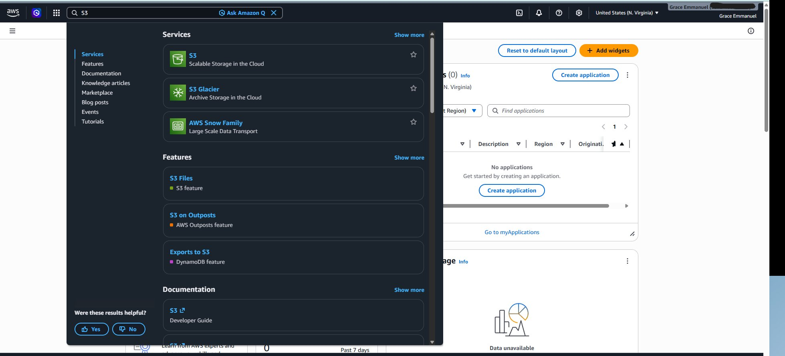
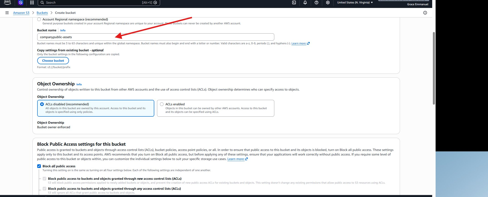
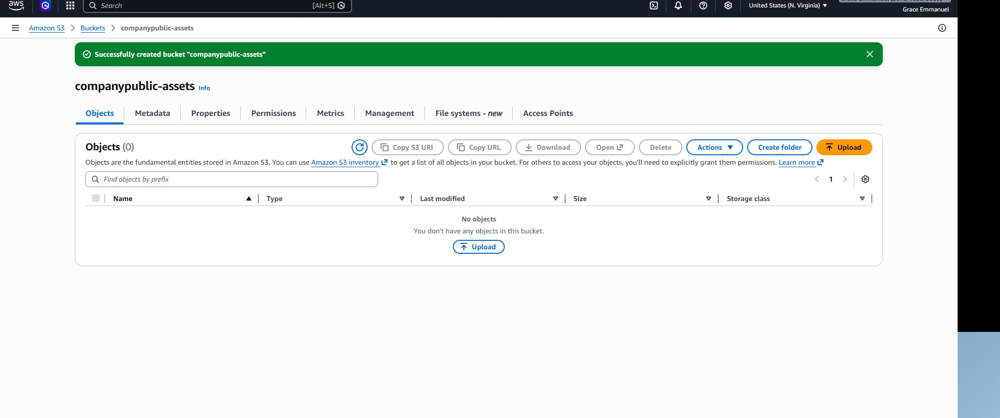
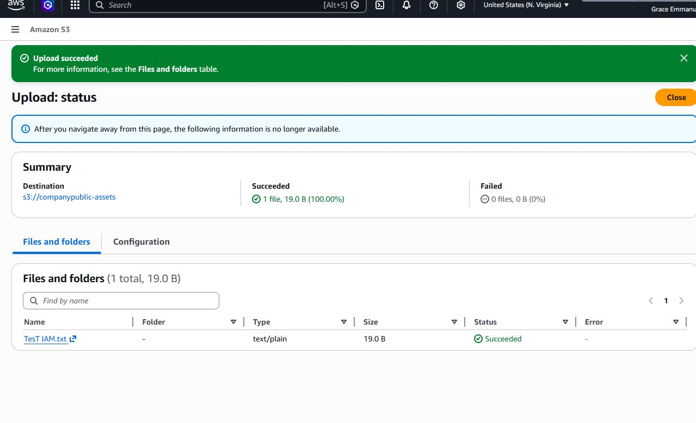
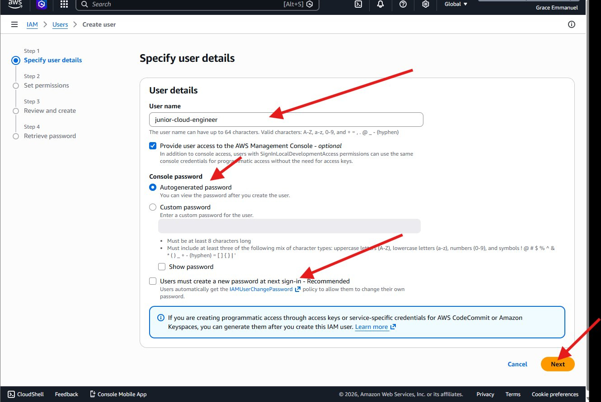
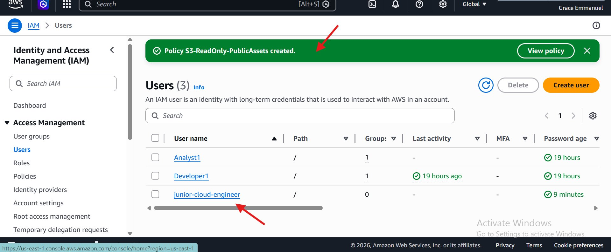
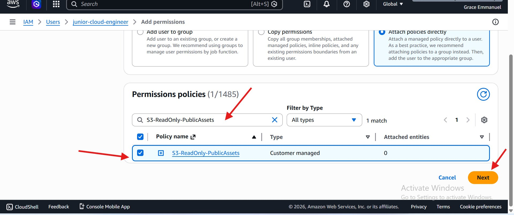
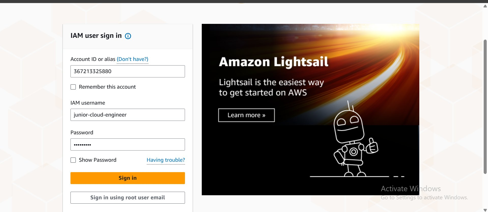
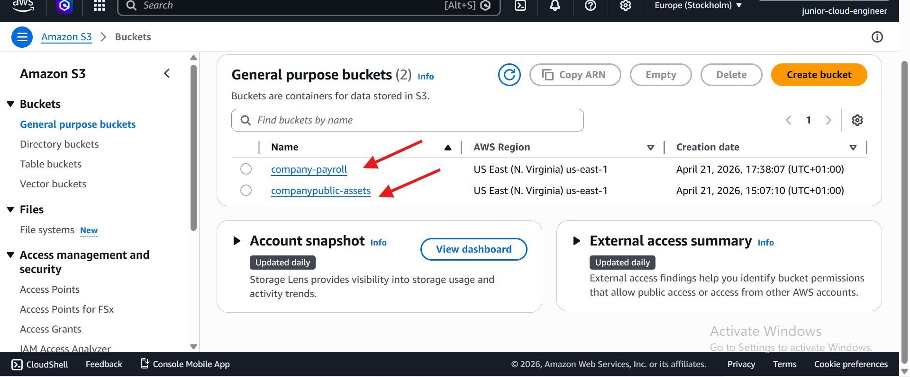
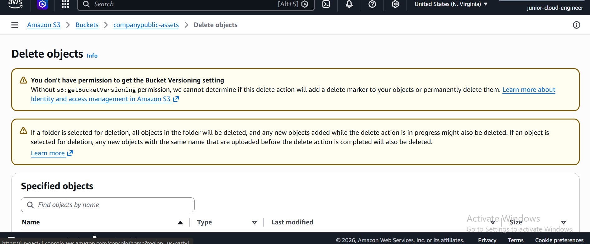

# 🔐 AWS IAM Least Privilege Lab

> **A hands-on security challenge demonstrating the Principle of Least Privilege on AWS — from identifying a broken policy to building a scoped IAM policy, creating an S3 bucket, and verifying that a Junior Cloud Engineer can only do exactly what they're supposed to.**

---

## 📋 Table of Contents

- [The Challenge](#the-challenge)
- [The Problem — Whats Wrong With This Policy](#the-problem--whats-wrong-with-this-policy)
- [The Fix — Rewriting the Policy Correctly](#the-fix--rewriting-the-policy-correctly)
- [Key Concepts](#key-concepts)
- [Architecture Overview](#architecture-overview)
- [Phase 1 — Create the S3 Bucket](#phase-1--create-the-s3-bucket)
- [Phase 2 — Upload a Test File](#phase-2--upload-a-test-file)
- [Phase 3 — Create the IAM User](#phase-3--create-the-iam-user)
- [Phase 4 — Create the Custom IAM Policy](#phase-4--create-the-custom-iam-policy)
- [Phase 5 — Attach the Policy to the User](#phase-5--attach-the-policy-to-the-user)
- [Phase 6 — Sign In and Verify Permissions](#phase-6--sign-in-and-verify-permissions)
- [Results — Least Privilege in Action](#results--least-privilege-in-action)
- [Security Lessons Learned](#security-lessons-learned)

---

## The Challenge

### Scenario

> A new **Junior Cloud Engineer** has joined the team. They only need to **view files** in an S3 storage bucket called `companypublic-assets`.
>
> They should **NOT** be able to:
> - Delete files
> - Access the `company-payroll` bucket
> - Modify any resources
> - List or access any other AWS service

### The Broken Policy

The current policy in place looks like this:

```json
{
  "Effect": "Allow",
  "Action": "s3:*",
  "Resource": "*"
}
```

**Your Tasks:**
1. Identify **two things wrong** with this policy
2. **Rewrite** the policy in JSON to follow the Principle of Least Privilege
3. **Build** the real-world implementation in AWS
4. **Verify** the policy works correctly by testing as the IAM user

---

## The Problem — Whats Wrong With This Policy

Before writing any code or clicking anything in the console, understand exactly what is broken.

### Problem 1 — Wildcard Action (s3:*)

```json
"Action": "s3:*"
```

The `s3:*` wildcard grants **every single S3 action** to the user, including:

| Action | What it does |
|---|---|
| `s3:DeleteObject` | Permanently delete any file |
| `s3:DeleteBucket` | Delete entire buckets |
| `s3:PutObject` | Upload and overwrite any file |
| `s3:PutBucketPolicy` | Change bucket-level security settings |
| `s3:GetBucketAcl` | Read access control lists |
| `s3:PutEncryptionConfiguration` | Modify encryption settings |

A Junior Cloud Engineer who only needs to **read** files has no business having delete, write, or administrative permissions.

### Problem 2 — Wildcard Resource ("Resource": "*")

```json
"Resource": "*"
```

The `*` wildcard applies the policy to **every S3 bucket and every object** in the entire AWS account:

- `companypublic-assets` — intended access only
- `company-payroll` — critical sensitive data, should be BLOCKED
- Any future bucket created in the account — automatic over-permission

### Summary of Problems

| Issue | Current (Broken) | Correct |
|---|---|---|
| **Actions** | `s3:*` — everything | `s3:GetObject`, `s3:ListBucket` — read only |
| **Resources** | `*` — all buckets | Specific ARN of `companypublic-assets` only |

---

## The Fix — Rewriting the Policy Correctly

### The Secure Policy

```json
{
  "Version": "2012-10-17",
  "Statement": [
    {
      "Sid": "AllowViewBucketList",
      "Effect": "Allow",
      "Action": "s3:ListAllMyBuckets",
      "Resource": "*"
    },
    {
      "Sid": "AllowListPublicAssetsBucket",
      "Effect": "Allow",
      "Action": "s3:ListBucket",
      "Resource": "arn:aws:s3:::companypublic-assets"
    },
    {
      "Sid": "AllowReadPublicAssetsObjects",
      "Effect": "Allow",
      "Action": "s3:GetObject",
      "Resource": "arn:aws:s3:::companypublic-assets/*"
    }
  ]
}
```

### Why Three Statements?

S3 permissions work at two levels — the **bucket level** and the **object level** — requiring separate statements:

| Statement | Action | Resource | Purpose |
|---|---|---|---|
| `AllowViewBucketList` | `s3:ListAllMyBuckets` | `*` | Lets the user see the S3 bucket list in the console |
| `AllowListPublicAssetsBucket` | `s3:ListBucket` | `arn:aws:s3:::companypublic-assets` | Lets the user see files inside the bucket |
| `AllowReadPublicAssetsObjects` | `s3:GetObject` | `arn:aws:s3:::companypublic-assets/*` | Lets the user download and view individual files |

> **Key insight:** `s3:ListBucket` controls visibility of bucket contents (applied to the bucket ARN). `s3:GetObject` controls access to individual files (applied to the ARN with `/*`). You need **both** to read files from the console.

---

## Key Concepts

| Term | Definition |
|---|---|
| **Principle of Least Privilege** | Grant only the minimum permissions required to perform a task — no more, no less |
| **IAM Policy** | A JSON document that defines what actions are allowed or denied on which AWS resources |
| **Customer Managed Policy** | A policy you write and control yourself, as opposed to AWS Managed Policies |
| **ARN** | Amazon Resource Name — a unique identifier for every AWS resource |
| **S3 Bucket** | A container for storing objects (files) in Amazon S3 |
| **S3 Object** | An individual file stored inside an S3 bucket |
| **Effect Allow/Deny** | Whether the statement permits or blocks the specified actions |
| **Sid** | Statement ID — a human-readable label for a policy statement |
| **Resource ARN with /*** | Applies the policy to all objects inside a bucket |

---

## Architecture Overview

```
┌─────────────────────────────────────────────────────────────┐
│                    AWS Account (Root)                        │
│                                                             │
│  ┌─────────────────┐    ┌──────────────────────────────┐   │
│  │   S3 Buckets    │    │        IAM                    │   │
│  │                 │    │                               │   │
│  │  companypublic  │    │  User: junior-cloud-engineer  │   │
│  │  -assets        │◄───│                               │   │
│  │  [accessible]   │    │  Policy: S3-ReadOnly-          │   │
│  │                 │    │          PublicAssets          │   │
│  │  company-payroll│    │                               │   │
│  │  [BLOCKED]      │    │  Permissions:                 │   │
│  │                 │    │  + s3:ListAllMyBuckets (allow) │   │
│  └─────────────────┘    │  + s3:ListBucket (allow)      │   │
│                         │  + s3:GetObject (allow)       │   │
│                         │  - s3:DeleteObject (blocked)  │   │
│                         │  - s3:PutObject (blocked)     │   │
│                         │  - payroll bucket (blocked)   │   │
│                         └──────────────────────────────┘   │
└─────────────────────────────────────────────────────────────┘
```

---

## Phase 1 — Create the S3 Bucket

### Step 1.1 — Search for S3

In the AWS Console, type **S3** in the top search bar and select **S3 — Scalable Storage in the Cloud**.



> **What you see:** The AWS global search results showing S3 under Services. Always click the top result under **Services** to open the S3 console.

---

### Step 1.2 — Open the S3 Landing Page

The Amazon S3 homepage loads with a quick-access **Create a bucket** card on the right side.


> **What you see:** The Amazon S3 product page. The **Create bucket** button is highlighted with a red arrow on the right-side card. Click it to start the bucket creation wizard.

---

### Step 1.3 — Configure the Bucket

On the Create bucket page, fill in the following settings:



> **What you see and what to set:**
>
> | Setting | Value | Reason |
> |---|---|---|
> | **Bucket name** | `companypublic-assets` | Must be globally unique. Use lowercase letters, numbers, and hyphens only. |
> | **Object Ownership** | ACLs disabled (recommended) | Access controlled by policies only, not ACLs. |
> | **Block all public access** | Checked (default) | Access is controlled through IAM policies, not internet-public settings. |
>
> The red arrow points to the **Bucket name** field. Scroll down and click **Create bucket**.

---

### Step 1.4 — Confirm Bucket Creation

A green success banner confirms the bucket was created.



> **What you see:** The `companypublic-assets` bucket detail page with a green banner: *"Successfully created bucket 'companypublic-assets'."* The bucket is empty (Objects: 0) and ready for files.

---

## Phase 2 — Upload a Test File

We need at least one file in the bucket to verify that our IAM user can read it.

### Step 2.1 — Upload the Test File

Inside the `companypublic-assets` bucket, click **Upload** and add your test file.


> **What you see:** The Upload page showing:
> - `TesT IAM.txt` (19.0 B, text/plain) added for upload
> - **Destination** — `s3://companypublic-assets`
>
> The red arrows highlight the file in the list and the **Upload** button (bottom-right). Click **Upload**.

---

### Step 2.2 — Confirm Upload Success



> **What you see:** The Upload status page confirming:
> - **Upload succeeded** — green banner
> - **Succeeded** — 1 file, 19.0 B (100%)
> - **Failed** — 0 files (0%)
> - `TesT IAM.txt` shows **Status: Succeeded**
>
> Note: *"After you navigate away from this page, the following information is no longer available."* Click **Close** to return to the bucket.

---

## Phase 3 — Create the IAM User

Now we create the IAM user that represents our Junior Cloud Engineer.

### Step 3.1 — Create the junior-cloud-engineer User

Navigate to **IAM > Users > Create user** and fill in the user details.



> **What you see:** Step 1 of 4 — Specify user details:
>
> | Field | Value | Notes |
> |---|---|---|
> | **User name** | `junior-cloud-engineer` | Descriptive name reflecting the role |
> | **Console access** | Enabled | The user needs to log in to the AWS Console |
> | **Console password** | Autogenerated password | AWS generates a secure random password |
> | **Users must create new password** | Unchecked | For this lab — allows direct sign-in with the autogenerated password |
>
> The red arrows highlight the username field, the Autogenerated password option, the password reset checkbox, and the **Next** button. Click **Next** to proceed. We will attach the policy after creating it in Phase 4.

---

## Phase 4 — Create the Custom IAM Policy

This is the core of the lab — writing the least-privilege policy from scratch.

### Step 4.1 — Navigate to IAM Policies

In the IAM left sidebar, click **Policies**.


> **What you see:** The Policies list showing **1484 policies** — a combination of AWS managed policies and customer managed policies. The red arrow points to **Policies** in the sidebar and the **Create policy** button (top-right, orange). Click **Create policy**.

---

### Step 4.2 — Write the Policy JSON

On the Create policy page, switch to the **JSON** tab and paste the secure policy.


> **What you see:** The **Policy editor** in JSON mode showing the `S3-ReadOnly-PublicAssets` policy being built. The right panel shows the Edit statement panel for `AllowViewBucketList`.

Paste this JSON into the editor:

```json
{
  "Version": "2012-10-17",
  "Statement": [
    {
      "Sid": "AllowViewBucketList",
      "Effect": "Allow",
      "Action": "s3:ListAllMyBuckets",
      "Resource": "*"
    },
    {
      "Sid": "AllowListPublicAssetsBucket",
      "Effect": "Allow",
      "Action": "s3:ListBucket",
      "Resource": "arn:aws:s3:::companypublic-assets"
    },
    {
      "Sid": "AllowReadPublicAssetsObjects",
      "Effect": "Allow",
      "Action": "s3:GetObject",
      "Resource": "arn:aws:s3:::companypublic-assets/*"
    }
  ]
}
```

> **Breaking down each statement:**
>
> **Statement 1 — AllowViewBucketList**
> `s3:ListAllMyBuckets` with `"Resource": "*"` — account-level action that lets the S3 console show the bucket list. Without this, the console shows nothing.
>
> **Statement 2 — AllowListPublicAssetsBucket**
> `s3:ListBucket` on the bucket ARN (no `/*`) — allows the user to see files listed inside `companypublic-assets`. Without this, the bucket appears but shows empty.
>
> **Statement 3 — AllowReadPublicAssetsObjects**
> `s3:GetObject` on `arn:aws:s3:::companypublic-assets/*` — the `/*` targets every object (file) within the bucket. Without this, files are listed but cannot be opened or downloaded.

After pasting the JSON, click **Next**, enter:
- **Policy name:** `S3-ReadOnly-PublicAssets`
- **Description:** `Grants read-only access to the companypublic-assets S3 bucket only`

Click **Create policy**.

---

### Step 4.3 — Confirm Policy Created



> **What you see:** A green banner confirms: *"Policy S3-ReadOnly-PublicAssets created."* The Users list now shows all three users:
>
> | User | Groups | Last Activity |
> |---|---|---|
> | `Analyst1` | 1 | — |
> | `Developer1` | 1 | 19 hours ago |
> | `junior-cloud-engineer` | 0 | — (9 minutes ago) |
>
> Note that `junior-cloud-engineer` has 0 groups — we will attach the custom policy directly next.

---

## Phase 5 — Attach the Policy to the User

### Step 5.1 — Search for and Attach the Custom Policy

Navigate to **IAM > Users > junior-cloud-engineer > Add permissions > Attach policies directly**.

Search for `S3-ReadOnly-PublicAssets` in the policy search box.



> **What you see:** The Add permissions page for `junior-cloud-engineer`:
>
> - **Permissions option:** `Attach policies directly` (highlighted in blue)
> - **Search box:** `S3-ReadOnly-PublicAssets` — returns 1 match
> - **Policy result:** Type: **Customer managed**, Attached entities: **0** (this is our new policy)
> - **Checkbox:** Selected (checked and highlighted in blue)
>
> The red arrows point to the search field, the policy checkbox, and the **Next** button. Click **Next**, review the summary, then click **Add permissions**.

---

## Phase 6 — Sign In and Verify Permissions

### Step 6.1 — Sign In as the IAM User

Navigate to the IAM sign-in URL and log in with the `junior-cloud-engineer` credentials.



> **What you see:** The IAM user sign in page with:
> - **Account ID:** `367213325880`
> - **IAM username:** `junior-cloud-engineer`
> - **Password:** (the autogenerated password from Phase 3)
>
> Click **Sign in** to proceed.

---

## Results — Least Privilege in Action

After signing in as `junior-cloud-engineer`, we test every expected permission and restriction.

---

### Test 1 — Can See the S3 Bucket List (Expected: ALLOWED)

Navigate to **S3 > General purpose buckets**.



> **What you see:** The S3 Buckets page showing **General purpose buckets (2)**:
>
> | Bucket | Region |
> |---|---|
> | `company-payroll` | US East (N. Virginia) |
> | `companypublic-assets` | US East (N. Virginia) |
>
> Both buckets are **listed** because `s3:ListAllMyBuckets` allows listing bucket names. **Seeing a bucket name is not the same as having access to it.** The key test is what happens when the user tries to open `company-payroll` — that will be denied because the policy only targets `companypublic-assets`.
>
> **Result: PASS** — Bucket list visible as expected.

---

### Test 2 — Cannot Access Table Buckets (Expected: BLOCKED)

Navigate to **S3 > Table buckets** in the left sidebar.


> **What you see:** An error panel: **"You don't have permission to list table buckets"**
>
> *"After you or your administrator updates your IAM permissions to allow `s3tables:ListTableBuckets`, refresh the table buckets list."*
>
> Our policy grants only specific standard S3 actions. Separate S3 features like Table buckets are completely blocked.
>
> **Result: PASS** — Access correctly denied.

---

### Test 3 — Cannot View Bucket Versioning (Expected: BLOCKED)

Navigate to the `TesT IAM.txt` object inside `companypublic-assets` and view its Properties tab.


> **What you see:** **"You don't have permission to view bucket versioning status"**
>
> *"You or your AWS administrator must update your IAM permissions to allow `GetBucketVersionioning`."*
>
> Our policy only granted `s3:ListAllMyBuckets`, `s3:ListBucket`, and `s3:GetObject`. Actions like `s3:GetBucketVersioning` are **not included** — so they are implicitly denied. AWS's default posture is **deny everything unless explicitly allowed**.
>
> **Result: PASS** — Administrative actions correctly blocked.

---

### Test 4 — Cannot Delete Files (Expected: BLOCKED)

Select `TesT IAM.txt` and attempt to delete it.



> **What you see:** The Delete objects page shows two warning banners:
>
> **Warning 1:** *"You don't have permission to get the Bucket Versioning setting. Without `s3:getBucketVersioning` permission, we cannot determine if this delete action will add a delete marker to your objects or permanently delete them."*
>
> **Warning 2:** Additional warning about permanent deletion risks.
>
> The user can navigate to the delete page but the actual delete operation will fail because `s3:DeleteObject` is not in the policy. The versioning warning appears because `s3:GetBucketVersioning` is also missing.
>
> **Result: PASS** — Deletion correctly blocked. The Junior Cloud Engineer cannot destroy data.

---

### Permission Test Summary

| Action Tested | Expected Result | Actual Result |
|---|---|---|
| List S3 bucket names | ALLOWED | PASS — Both buckets visible in list |
| List files in `companypublic-assets` | ALLOWED | PASS — TesT IAM.txt visible |
| Read/download files from `companypublic-assets` | ALLOWED | PASS — File accessible |
| Access `company-payroll` bucket contents | BLOCKED | PASS — Access denied |
| Delete files | BLOCKED | PASS — Permission denied |
| View bucket versioning | BLOCKED | PASS — Permission denied |
| Access Table buckets | BLOCKED | PASS — Permission denied |
| Modify any resource | BLOCKED | PASS — No write permissions |

**Result: 8 of 8 — Policy behaves exactly as intended.**

---

## Security Lessons Learned

**1. Wildcards are a security risk**
`s3:*` and `"Resource": "*"` are convenient but destroy your security posture. Every wildcard in a policy should be questioned: Do they really need ALL of these?

**2. Implicit Deny is your friend**
AWS denies all actions by default. You do not need explicit Deny statements for everything you do not want — simply do not include those actions in your Allow statements.

**3. Bucket-level vs Object-level permissions**
S3 requires separate permission statements for bucket-level operations (`s3:ListBucket` on the bucket ARN) and object-level operations (`s3:GetObject` on `bucket-arn/*`). Confusing these is a common mistake.

**4. Console usability sometimes requires broad actions**
`s3:ListAllMyBuckets` requires `"Resource": "*"` because it is an account-level action. This is an accepted trade-off — the user sees bucket names but can only access the authorised one.

**5. Seeing is not the same as accessing**
The user can see `company-payroll` in the bucket list but cannot open it, list its contents, or touch its objects. Listing bucket names is a console usability requirement, not a security hole.

**6. Always test your policies**
Always log in as the target user to verify the policy behaves as intended — both that allowed actions work and that blocked actions are rejected.

---

## The Complete Secure Policy (Reference)

```json
{
  "Version": "2012-10-17",
  "Statement": [
    {
      "Sid": "AllowViewBucketList",
      "Effect": "Allow",
      "Action": "s3:ListAllMyBuckets",
      "Resource": "*"
    },
    {
      "Sid": "AllowListPublicAssetsBucket",
      "Effect": "Allow",
      "Action": "s3:ListBucket",
      "Resource": "arn:aws:s3:::companypublic-assets"
    },
    {
      "Sid": "AllowReadPublicAssetsObjects",
      "Effect": "Allow",
      "Action": "s3:GetObject",
      "Resource": "arn:aws:s3:::companypublic-assets/*"
    }
  ]
}
```

---

## Resources

- [AWS IAM Policy Reference](https://docs.aws.amazon.com/IAM/latest/UserGuide/reference_policies.html)
- [Amazon S3 Actions Reference](https://docs.aws.amazon.com/AmazonS3/latest/userguide/list_amazons3.html)
- [IAM Policy Best Practices](https://docs.aws.amazon.com/IAM/latest/UserGuide/best-practices.html)
- [Principle of Least Privilege — AWS](https://docs.aws.amazon.com/IAM/latest/UserGuide/best-practices.html#grant-least-privilege)
- [AWS Policy Simulator](https://policysim.aws.amazon.com/) — Test your policies without affecting real resources

---

## Author

**Grace Emmanuel** — Cloud and Cybersecurity  
GitHub: [@CyberGracie](https://github.com/CyberGracie/CyberGracie)

---

> *This lab is part of a hands-on AWS IAM security series. All screenshots are from a live AWS environment.*
